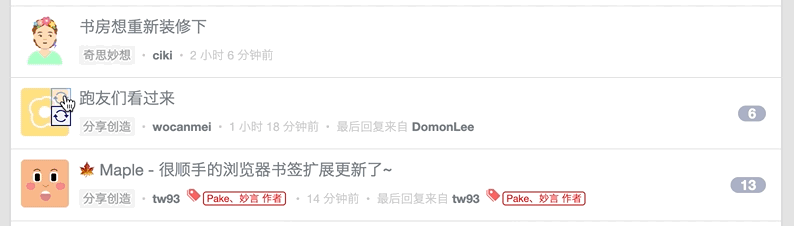
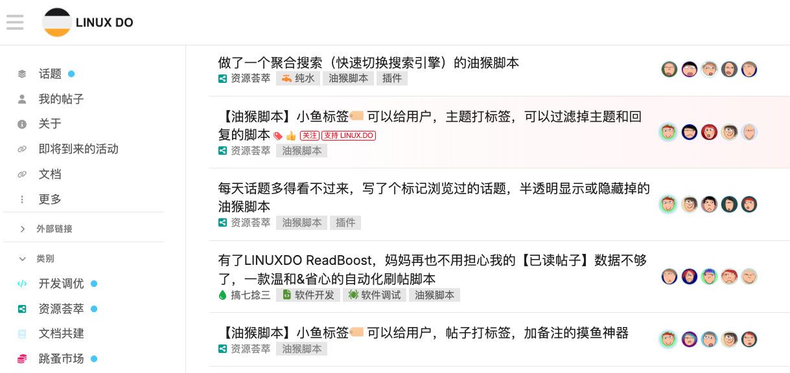

# Replace Ugly Avatars | 赐你个头像吧

    

🔃 Replace specified user's avatar (profile photo) and username (nickname).

🔃 换掉别人的头像与昵称。

## Application Scenarios

This script has a variety of practical application scenarios. Here are the details for you:

- **Enhance Visual Experience**: When you find someone's profile picture 🤡 extremely unpleasant, you can use this script to replace it with a harmless one 🥸, instantly making your visual experience more comfortable.
- **Express Your Attitude**: If someone's remarks are always stupid and disgusting, you can give them a 🐷 pig - head profile picture. Then, when you see them again, you can simply skip over them and avoid the annoyance.
- **Avoid Distraction**: In various situations, there are always some "slackers" with very familiar profile pictures that unconsciously draw your attention. By changing their profile pictures, you can forcefully create a sense of unfamiliarity and effectively distract your attention.
- **Reduce Interference**: Some platforms are filled with a large number of "momo" profile pictures or those with political associations, which can easily interfere with you. Use this script to randomly change their profile pictures and free yourself from such interference (more websites will be supported in the future).
- **Meet the Needs of OCD**: If you have obsessive - compulsive disorder and want all profile pictures to have a unified style, this script can easily fulfill your wish.
- **Kill Boredom**: When you're bored, you can use the script to continuously change profile pictures 🔃, killing time and adding a bit of fun in the process.

## 应用场景

此脚本具备多种实用的应用场景：

- **改善视觉体验**：当您看到某人的头像 🤡 实在令人不适时，不妨使用本脚本为其更换一个人畜无害的头像 🥸，瞬间让您的视觉感受更加舒适。
- **表达态度**：若某人的言论总是愚蠢又令人反感，您可以给他换上一个 🐷 猪头头像。此后再看到他，您便能直接跳过，眼不见心不烦。
- **避免注意力分散**：在各种场合，总有一些 “摸鱼王”、“水王” 的头像十分眼熟，您的注意力会不自觉地被吸引过去。此时，通过更换他们的头像，强制营造出陌生感，从而有效分散您的注意力。
- **减少干扰**：某些平台上充斥着大量 “momo” 头像或带有政治关联的头像，这些头像容易对您造成干扰。使用本脚本为它们随机更换头像，让您免受干扰之苦 （后续还将支持更多网站）。
- **满足强迫症需求**：如果您有强迫症，希望所有人的头像都呈现统一风格，那么本脚本就能轻松帮您达成心愿。
- **打发无聊时光**：当您感到无聊时，不妨用脚本不断更换头像 🔃，在这个过程中消磨时间，增添一些小乐趣。

## For Now It Works On

目前支持的网站

- V2EX ([www.v2ex.com](https://www.v2ex.com/))
- LINUX DO ([linux.do](https://linux.do/))



---


---


---


---



---


---


## Installation

- Chrome Extension: [Manual Installation](manual-installation.md)
- Edge Extension: [Manual Installation](manual-installation.md)
- Firefox Addon: [Manual Installation](manual-installation.md)
- Userscript: [https://greasyfork.org/scripts/472616-replace-ugly-avatars](https://greasyfork.org/scripts/472616-replace-ugly-avatars)

## Avatar Sources

We use [DiceBear](https://www.dicebear.com/)'s API to generate random avatars. Thanks to the [DiceBear](https://github.com/dicebear/dicebear) project and [designers](https://www.dicebear.com/licenses) for the great works.

We also use the [ugly-avatar](https://github.com/txstc55/ugly-avatar) project and the [ugly-avatar-api](https://github.com/mamumu123/next-api-share) project to generate random avatars. Thanks to these two projects for the great works.

We also use [Gfriends](https://github.com/gfriends/gfriends)' avatar images as random avatars. Thanks to the [Gfriends](https://github.com/gfriends/gfriends) project.

## Release Notes

- 0.5.0
  - Add ugly-face avatar
  - Implement support for the avatar replacement feature on the linux.do website
- 0.4.0
  - Support multi-languages
- 0.3.0
  - Add Japan Girl Friends avatars
- 0.2.0
  - Automatically update all avatars
- 0.1.1
  - Add options to enable/disable each style
- 0.1.0
  - Add settings, add enable option, add clear data option
- 0.0.6
  - Add more random parameters
- 0.0.5
  - Add image change animation, convert username to lowercase
- 0.0.1
  - Change the avatars on [V2EX](https://wwww.v2ex.com)

## Development

This extension/userscript is built from [Browser Extension Starter and Userscript Starter](https://github.com/utags/browser-extension-starter)

## Features

- One codebase for Chrome extesions, Firefox addons, Userscripts, Bookmarklets and simple JavaScript modules
- Live-reload and React HMR
- [Plasmo](https://www.plasmo.com/) - The Browser Extension Framework
- [esbuild](https://esbuild.github.io/) - Bundler
- React
- TypeScript
- [Prettier](https://github.com/prettier/prettier) - Code Formatter
- [XO](https://github.com/xojs/xo) - JavaScript/TypeScript linter

## Showcases

- [🏷️ UTags - Add usertags to links](https://github.com/utags/utags) - Allow users to add custom tags to links.
- [🔗 Links Helper](https://github.com/utags/links-helper) - Open external links in a new tab, open internal links matching the specified rules in a new tab, convert text to hyperlinks, convert image links to image tags, parse Markdown style links and image tags, parse BBCode style links and image tags

## How To Make A New Extension

1. Fork [this starter repo](https://github.com/utags/browser-extension-starter), and rename repo to your extension name

2. Clone your repo

3. Install dependencies

```bash
pnpm install
# or
npm install
```

## Getting Started

First, run the development server:

```bash
pnpm dev
# or
npm run dev
```

Open your browser and load the appropriate development build. For example, if you are developing for the chrome browser, using manifest v3, use: `build/chrome-mv3-dev`.

You can start editing the popup by modifying `popup.tsx`. It should auto-update as you make changes. To add an options page, simply add a `options.tsx` file to the root of the project, with a react component default exported. Likewise to add a content page, add a `content.ts` file to the root of the project, importing some module and do some logic, then reload the extension on your browser.

For further guidance, [visit our Documentation](https://docs.plasmo.com/)

## Making production build

Run the following:

```bash
pnpm build
# or
npm run build
```

This should create a production bundle for your extension, ready to be zipped and published to the stores.

## Submit to the webstores

The easiest way to deploy your Plasmo extension is to use the built-in [bpp](https://bpp.browser.market) GitHub action. Prior to using this action however, make sure to build your extension and upload the first version to the store to establish the basic credentials. Then, simply follow [this setup instruction](https://docs.plasmo.com/framework/workflows/submit) and you should be on your way for automated submission!

## License

Copyright (c) 2023 [Pipecraft](https://www.pipecraft.net). Licensed under the [MIT License](LICENSE).

## >\_

[](https://www.pipecraft.net)
[](https://utags.pipecraft.net)
[](https://dto.pipecraft.net)
[](https://www.bestxtools.com)
